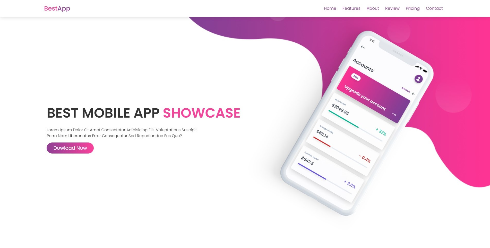
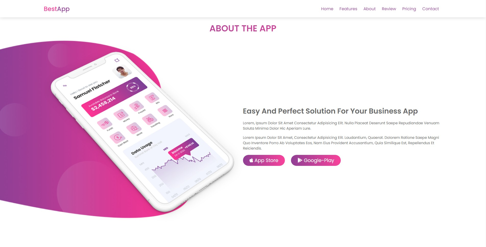
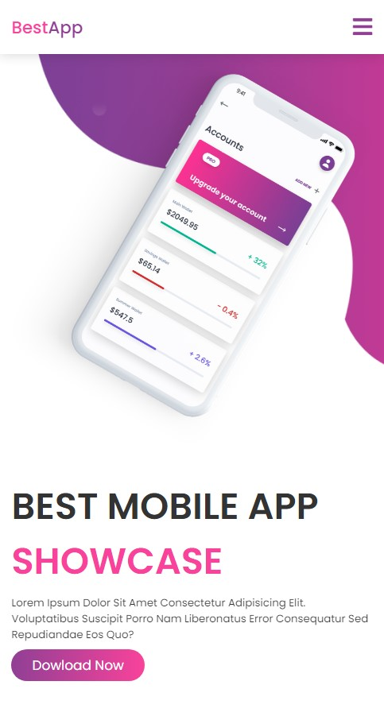
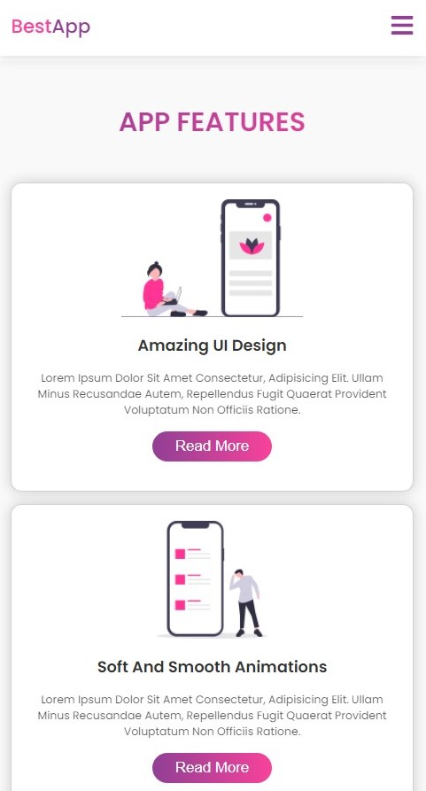
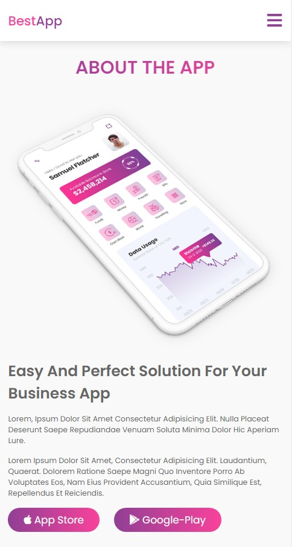
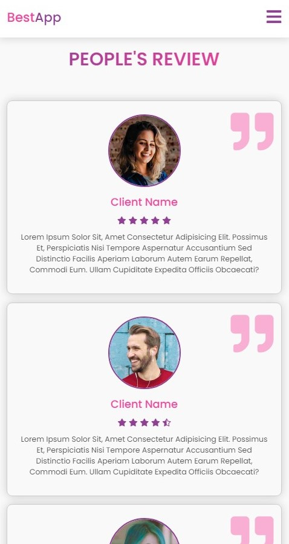
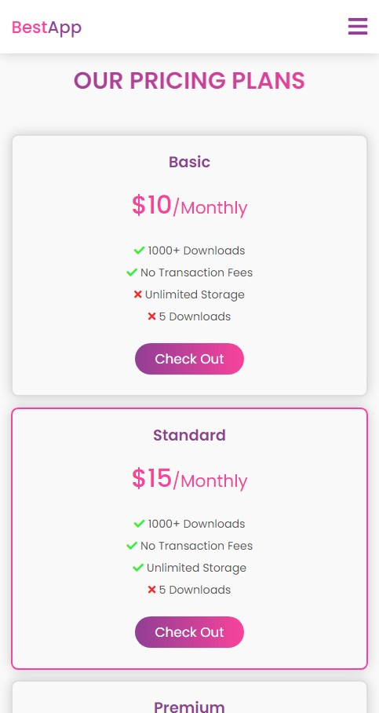
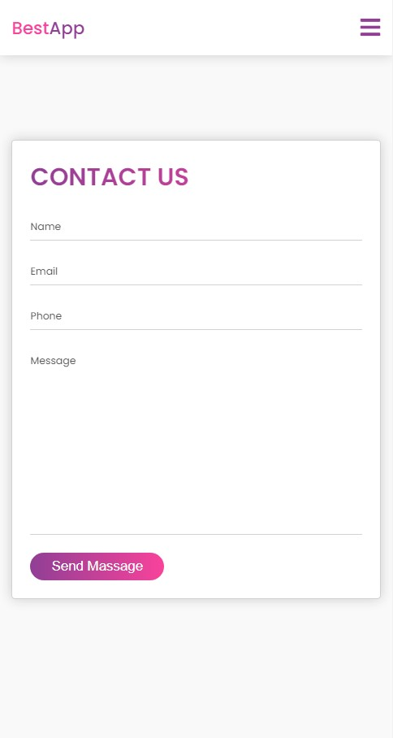

<h1>📱 BestApp Project  📱</h1>

#### Description: ####

The ***BestApp*** project was my first front-end project, which consists of a promotional lending page for a mobile application. My intention with this project was to practice my recent knowledge in 
***CSS3*** and ***HTML5***.

#### Technologies used: ####

#### Screenshots: ####

    <h6>Home</h6>
    
     
    <h6>About</h6>
    

    <h6>Mobile</h6>
    
    
    
    
    
    

  <a href="https://github.com/Devittor/practical-projects/tree/main/bestapp">
    <strong>↩ Back to home</strong>
  </a>

#### 🔍 Contact me on: ####

  
  
      

